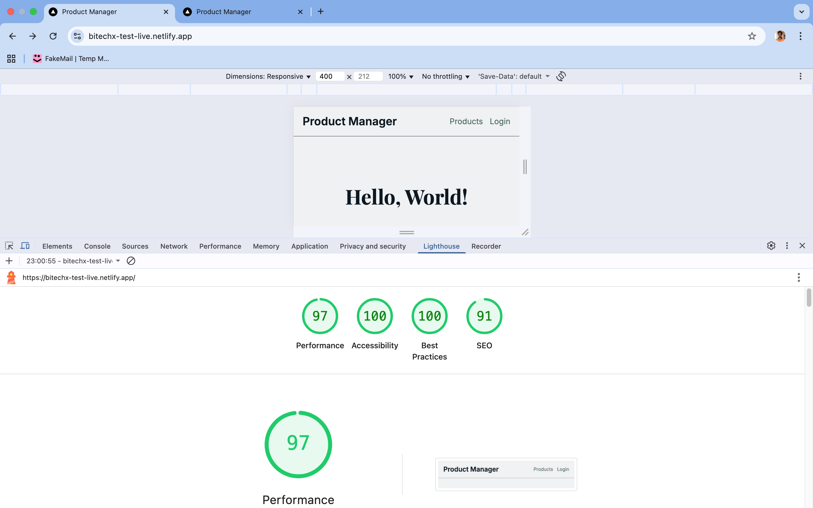
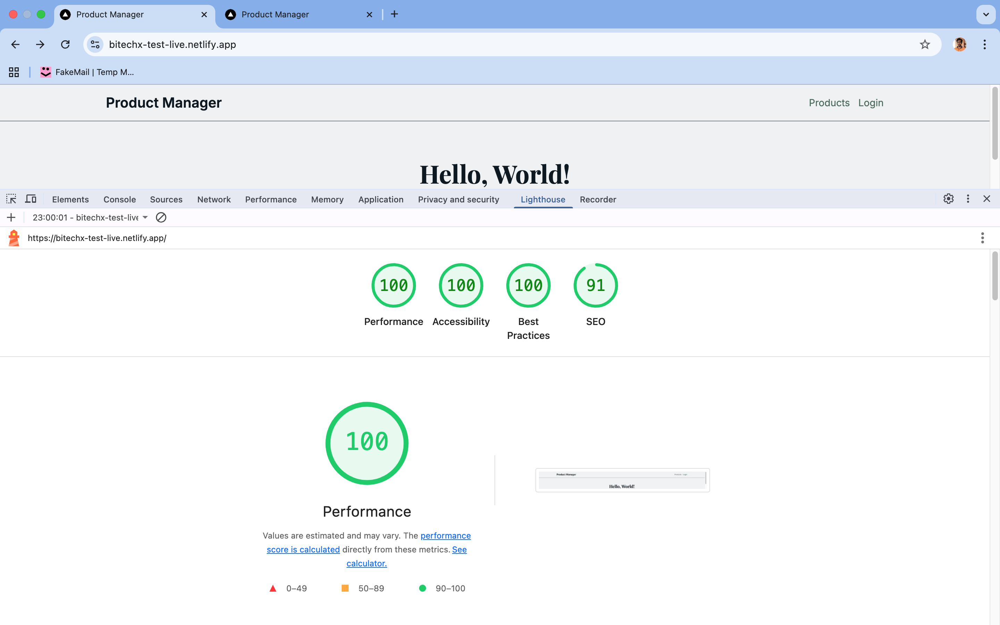

# Product Management App (Next.js)

A modern Next.js 15 (App Router) app for managing products with auth, CRUD, search, pagination, and category filtering. Built with TypeScript, Redux Toolkit + RTK Query, Tailwind CSS v4, react-hook-form + zod, and react-hot-toast.

- Live: `https://bitechx-test-live.netlify.app/`
- GitHub: `https://github.com/masud001/bitechx-test-project`
- API Base: `https://api.bitechx.com`

## Tech Stack
- Next.js 15 (App Router), TypeScript
- Redux Toolkit + RTK Query
- Tailwind CSS v4 (semantic tokens)
- react-hook-form + zod, react-hot-toast
- Vitest + React Testing Library

## Features
- Auth: email-only login via `/auth`; JWT stored in Redux and sent as `Authorization: Bearer <token>`.
- Products: list, details, create, edit, delete.
- Search: debounced realtime search by name.
- Pagination: offset/limit with accessible controls.
- Category filter: filter list by category.
- Light / Dark mode.
- UX: confirmation modal on delete, skeletons, clear error states.

## Environment
Create `.env.local`:

```env
NEXT_PUBLIC_API_BASE=https://api.bitechx.com
AUTH_EMAIL=madhnagar@gmail.com
NEXT_PUBLIC_SITE_NAME="Product Manager"
```

## Setup
- Install: `npm install`
- Dev: `npm run dev` (use `-- -p 3002` for port)
- Lint/Type: `npm run lint`, `npm run typecheck`
- Test: `npm run test`
- Build/Start: `npm run build`, `npm run start`

## Structure
```
src/
  app/ (App Router: layout, pages)
    products/page.tsx
    products/[slug]/page.tsx
    products/[slug]/edit/page.tsx
    login/
  components/ (UI, forms, modal, pagination, card)
  features/ (auth, products, categories APIs)
  store/ (Redux store + hooks)
  lib/ (utils, images)
```

## API
Base: `process.env.NEXT_PUBLIC_API_BASE`
- POST `/auth` → `{ token }`
- GET `/products?offset&limit&categoryId`
- GET `/products/:slug`
- GET `/products/search?searchedText`
- POST `/products` `{ categoryId, description, images[], name, price }`
- PUT `/products/:id`
- DELETE `/products/:id` (simulated)
Headers: `Authorization: Bearer <token>`, `Content-Type: application/json`.

## Data Layer
- RTK Query for endpoints, caching, invalidation.
- `prepareHeaders` attaches JWT from `auth` slice to every request.
- Search debounced (300ms) and resets pagination to page 1.

## Forms & Validation
- `react-hook-form` + `zodResolver` rules:
  - name: string().min(2).max(150)
  - price: number().positive()
  - description: string().max(2000).optional()
  - images: array(string().url()).min(1)
  - categoryId: string().uuid() (or required id)

## Styling & Colors
Tailwind v4 semantic tokens (see `src/app/globals.css` and `colors.md`):
- Tokens: `--color-bg`, `--color-text`, `--color-primary`, `--color-secondary`, `--color-accent`.
- Examples: `bg-bg`, `text-text`, `bg-primary text-text-light hover:bg-primary/90`.
- Image domains configured in `next.config.ts` (e.g., `i.imgur.com`, `laravelpoint.com`).

## Routing
- `/login` → login redirect to `/products`.
- `/products` → list + search + pagination + filter.
- `/products/create` → create form (shared form).
- `/products/[slug]` → details with edit/delete.
- `/products/[slug]/edit` → edit with prefilled data.

## Deployment
- Vercel: add env vars (same as `.env.local`), connect GitHub, auto-deploy.
- Netlify: `netlify.toml` included; set env vars in Site settings. Build: `npm run build`, publish: `.next`. Next.js plugin handles App Router.

## Testing & CI
- Vitest + RTL; sample: `src/components/__tests__/Pagination.spec.tsx`.
- CI (`.github/workflows/ci.yml`): lint, typecheck, test, build.

## Accessibility & UX
- Semantic HTML; accessible modal (`role="dialog"`, `aria-modal="true"`).
- Keyboard navigation; focus management; clear loading and error states.

## Troubleshooting
- ENOENT for `_document.js`: stop dev, delete `.next/`, restart; ensure no `pages/` or `next/document` imports.
- Verify env vars in local and hosting dashboards.

## Roadmap
- Dark mode via `@theme dark`.
- Category management UI; filtering chips.
- More tests for CRUD and forms.

## Lighthouse Performance Reports
These screenshots show Lighthouse performance reports for the app.

## Lighthouse Report for Mobile



